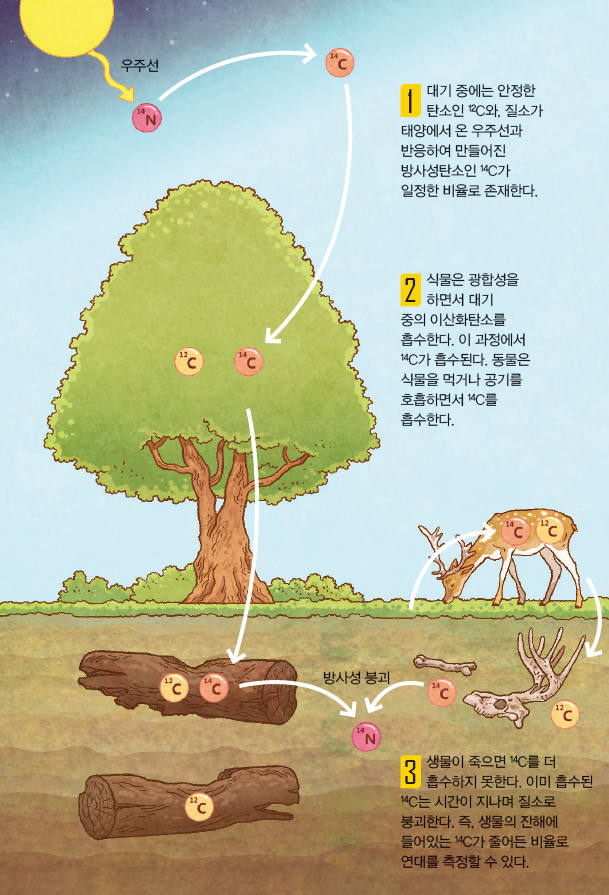
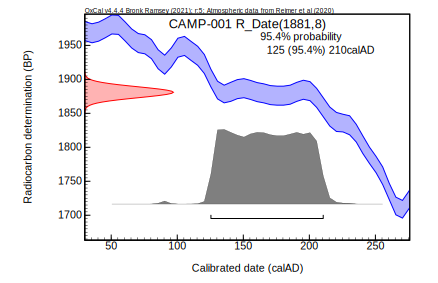
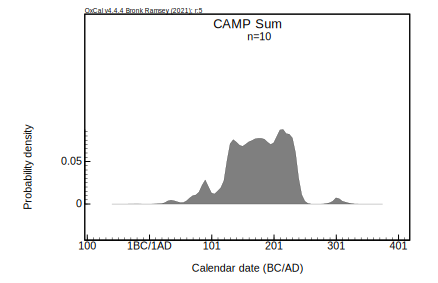
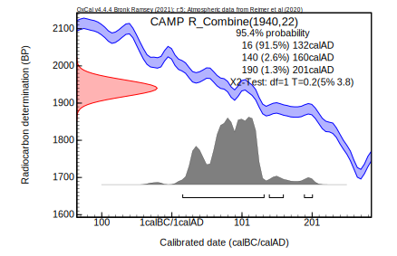
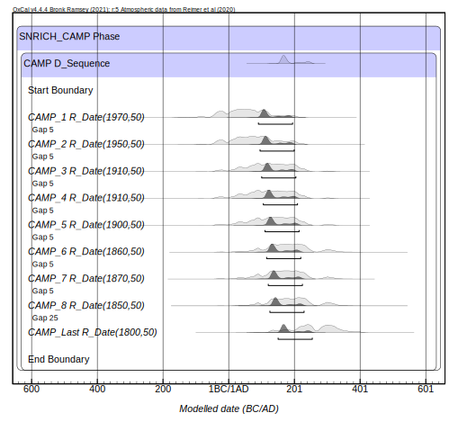
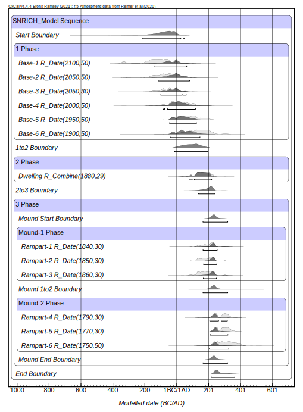

# 2026년 국립문화유산연구원 발굴캠프 - OxCal 실습

<div style="text-align: right;">
  주찬혁(국립서울문화유산연구소)
</div>
<br>

> **강의 목표**: 방사성탄소연대측정법의 기본 개념을 이해하고, OxCal을 활용하여 기초적인 분석을 수행해봅니다.
> 
## 1. 방사성탄소연대측정법의 정의와 원리

### 정의

**방사성탄소연대측정법(Radiocarbon Dating)** 이란 **동위원소 연대측정법**의 한 가지로, 시료 내의 $^{14}\text{C}$ 개수를 측정하여 시료의 대사작용이 중단된 시점을 추적하는 방법론입니다. 이는 1940년대 후반 미국의 화학자 **윌러드 리비(Willard F. Libby)** 에 의해 개발되었으며, 그는 이 공로를 인정받아 1960년 노벨 화학상을 수상하였습니다. 

### 원리



구체적인 원리는 대기 중에서 일어나는 탄소 동위원소의 형성과 순환, 그리고 방사성 붕괴 메커니즘에 기반합니다. 우주선(Cosmic rays)에 의해 대기 상층부에서 생성된 중성자가 $^{14}\text{N}$ 원자핵과 충돌하면 방사성 동위원소인 $^{14}\text{C}$가 형성됩니다. 이 $^{14}\text{C}$는 이산화탄소 형태로 대기 중에 고르게 분산되며, 광합성이나 섭취 등을 통해 모든 생물체의 조직 내에 흡수되는데, 생전에는 $^{14}\text{C}$가 안정 동위원소인 $^{12}\text{C}$, $^{13}\text{C}$과 일정한 비율을 유지하게 됩니다. 그러나 개체가 죽은 순간부터 새로운 $^{14}\text{C}$의 유입은 중단되고, 이미 조직 내에 존재하던 $^{14}\text{C}$는 약 5,730년의 반감기를 거치며 일정한 속도로 붕괴됩니다. 따라서 시료에 남아 있는 $^{14}\text{C}$의 잔존 비율을 정밀하게 측정하면 개체가 죽은 시점의 연대를 산출할 수 있습니다.

### 보정곡선

그러나 측정한 방사성탄소연대를 실제 우리가 사용하는 역연대로 곧바로 치환할 수는 없습니다. 과거 대기 중의 $^{14}\text{C}$의 농도가 일정하지 않고 변동했기 때문입니다. 지구 자기장의 변화나 태양 활동의 주기적 변동으로 인해 우주선의 유입량이 달라졌고, 산업화나 핵개발 등으로 인해 대기 중 $^{14}\text{C}$의 농도 역시 변했습니다. 현재는 이를 극복하기 위해 **수륜연대보정(Tree-ring Calibration)** 을 실시하고 있습니다. 역연대가 알려진 나무들을 대상으로 나이테마다 방사성탄소연대를 측정한 뒤, 이를 병합하여 보정곡선(IntCal Calibration Curve)을 구성합니다. 이후 측정된 연대를 이 보정곡선에 대입하면 비정형적인 곡선 형태로 계산되는데, 측정치를 역연대로 표현하기 위해서는 반드시 보정 과정을 거쳐야 합니다.

보정곡선은 과거 대기 중 $^{14}\text{C}$ 농도의 변동으로 인해 수많은 굴곡, 즉 '위글(Wiggle)' 로 이루어져 있습니다. 이러한 굴곡으로 내에는 일정 구간 동안 경사가 없는 평탄면(Plateau)이 존재하는데, 각 연대의 $^{14}\text{C}$ 농도가 유사하여 측정값이 변하지 않고 동일합니다. 따라서 이 구간에 속하는 시료를 분석하면, 하나의 측정값이 특정 시점으로 수렴하지 못하고 평탄면이 걸쳐 있는 넓은 범위로 확률분포가 흩어져 연대 특정이 불가능해집니다. 이러한 평탄면 중에서도 B.C. 800년경부터 B.C. 400년경 사이에 걸쳐 평탄하게 나타나는 악명 높은 구간이 있는데, 이를 국제적으로는 유럽 초기 철기시대 문화의 이름을 따 할슈타트 평탄면(Hallstatt plateau)이라고 부릅니다.

### 측정법

방사성탄소연대측정에도 다양한 방법이 있습니다. 과거에는 주로 $^{14}\text{C}$가 붕괴할 때 방출되는 베타 입자를 측정하는 방식(Beta Counting)에 주로 의존하였으나, 이는 대량의 시료가 필요하다는 한계가 있었습니다. 이에 따라 최근에는 가속기 질량분석법(AMS, Accelerator Mass Spectrometry)이 전면적으로 활용되고 있는데, 이는 $^{14}\text{C}$의 원자핵을 직접 가속하여 그 개수를 정밀하게 계측하고, 단 몇 밀리그램(mg) 수준의 극소량 시료만으로도 연대 측정이 가능합니다.

### 주의사항

연구자가 반드시 주지해야 할 사항은, 이렇게 도출된 방사성탄소연대가 특정 '시점(Point)'을 의미하는 것은 아니며, '확률 분포(Probability Distribution)'라는 점 입니다. 모든 연대 측정값은 항상 오차범위(예: $1950 \pm 30\text{ BP}$)를 동반하며, 이를 보정하면 비정형적인 확률 밀도 형태로 표현된다. 따라서 개별 연대 값을 평면적으로 해석해서는 안되며, 항상 확률의 개념임을 주지해야합니다.

최근에는 다양한 프로그램들이 개발되어 방사성탄소연대측정치를 활용하기 쉬워지고 있습니다. 이중 가장 기본적이고 보편적으로 사용되고 있는 것이 Oxcal인데, 뒤에서는 이를 활용하여 분석을 수행해보도록 하겠습니다.

----------

## 2. OxCal과 분석 환경 구성

### OxCal?

`OxCal`이란?
`OxCal`은 영국 옥스퍼드 대학교의 크리스토퍼 브롱크 램지(Christopher Bronk Ramsey)가 개발한 방사성탄소연대 관련 소프트웨어이입니다. 통계학적 연산과 확률 분포 그래프를 기반으로 하여, 여러 연대 측정치들을 쉽고 체계적으로 분석할 수 있게 해줍니다. `OxCal`은 무료로 제공되고 있으며, 컴퓨터에 직접 설치하여 사용할 수도 있고, 온라인 클라우드 환경을 통해서도 사용할 수 있으며, [OxCal 주소](https://c14.arch.ox.ac.uk/oxcal.html)를 통해 접속할 수 있습니다.

### 환경 구성

#### 1. 온라인 클라우드 환경

1. 홈페이지 우측의 `Oxcal Oline` 토글을 클릭

2. 'New' 버튼 클릭 후 계정 생성

3. 생성한 아이디와 비밀번호로 로그인

#### 2. 로컬 환경

1. 홈페이지 우측의 `Download Oxcal` 토글을 클릭

2. 파일 압축 풀기 이후 `C:\Program Files` 주소로 `Oxcal` 폴더를 이동

2. [Node.js](https://nodejs.org/en)를 설치
    - 홈페이지 접속 → `Download` 클릭 → **운영체제**에 따라 설치 진행
        - MacOS : Or get a prebuilt Node.js® for **Mac OS** running a **Intel 시리즈: x86 or M 시리즈: ARM64** architecture 선택 → `macOS Installer (.pkg)` 클릭 후 설치
        - Windows : Or get a prebuilt Node.js® for **Windows** running a **x64** architecture 선택 → `Windows Installer (.msi)` 클릭 후 설치
    - 터미널 환경 접속
        - MacOS & Linux: Command(⌘) + Spacebar 누르기 → 터미널(Terminal) 검색 후 실행
        - Windows: Win(⊞) + X 누르기 → 터미널(관리자) 클릭
    - 아래의 명령어 순차적으로 입력
##### MacOS
``` bash
cd '/Applications/OxCal' #설치 공간으로 이동

node NodeServer.js #서버 실행

*이후 창 최소화(절대 끄면 안됨)
```

##### Windows
``` Powershell
cd 'C:\Program Files\OxCal' #설치 공간으로 이동

node NodeServer.js #서버 실행

*이후 창 최소화(절대 끄면 안됨)
```

4. 웹 브라우저로 이동 후, `http://localhost:8080/` 입력

5. Setup에서 아래와 같이 입력
    - Localhost port: 8080
    - Home directory: C:\Program Files\OxCal
    - Web directory: C:\Program Files\OxCal
    - OxCal binary: C:\Program Files\OxCal\bin\OxCalWin.exe
6. `save` 클릭 → `OxCal` 클릭

## 3. 데이터 수집

방사성탄소연대 분석을 위한 기초 데이터는 1980년대 이후 꾸준히 발간되어 온 각 유적의 구제 발굴(Rescue) 조사 보고서나 관련 학술 논문에 기재되어 있습니다. 성공적인 분석과 데이터베이스 구축을 위해서는 문헌 속에 흩어져 있는 자료들을 분석 가능한 통일된 형식으로 정리하는 과정이 필수적입니다. 수집하는 데이터는 고고학적 신뢰성을 확보하기 위해 필수적으로 기입해야 하는 항목과, 연구 방향에 따라 유연하게 추가할 수 있는 선택적 항목으로 나눌 수 있습니다.

### 필수 항목

- **유적명**: 데이터의 출처가 되는 전체 유적의 명칭(예: 서울 풍납토성)

- **유구명**: 유적 내에서 시료가 출토된 개별 유구(예: 서성벽 23번 피트)

- **출토 맥락**: 시료가 수습된 정확한 층서적 위치나 유구 내의 구체적인 퇴적 상태(예: 3토루 내부 점토층)

- **BP**: 실험실에서 기계적으로 측정된 보정 전 연대 값

- **Error**: BP 값에 동반되는 통계적 오차 범위(±)

- **재질**: 측정에 사용된 유기물의 종류(목탄, 골각, 단일 탄화종자 등)

- **LabID**: 분석을 수행한 기관에서 부여한 고유 번호

- **$\delta^{13}\text{C}$**: 안정동위원소 비율, 시료의 기원(C3/C4 식물 구분 등)이나 식생 환경, 해양 리저버 효과(Marine Reservoir Effect) 등을 파악하고 교정하기 위한 목적

### 선택 항목
- **공간 좌표**: GIS를 활용한 공간 분포 분석이나 밀도 분석을 수행할 경우 필요한 X, Y 좌표 및 표고 데이터

- **유구 및 유물의 유형 및 형식 구분**: 출토된 토기의 기종과 형식, 가마의 구조적 특징과 크기, 주거지의 평면 형태 등 분석의 세부 목적에 맞게 자유롭게 항목 구성

## 4. 기초 분석

### 4.1. `R_Date`

#### 설명

개별 시료의 연대를 보정하고, 그 확률 분포를 확인하는 데 사용됩니다. 분석은 아래와 같은 절차에 따라 진행됩니다.

#### 분석

1. `Insert` ➔ `R_Date` 클릭

2. `Name`, `14C Date`, `Uncertainty` 란에 측정치 기입
    - `Name` : 시료를 특정지을 수 있는 고유 명칭(LabID 등)
    - `14C Date` : 측정된 BP값
    - `Uncertainty` : 측정된 Error값

    ※ 엑셀로 정리된 다수의 데이터가 있는 경우 복사 후, `Tools` ➔ `Import`로 일괄 반영 가능

3. `Run` 버튼을 클릭하여 분석 실행

4. 산출된 그래프는 `Format` 및 `View` 탭을 활용해 조정

5. 결과물은 `File` ➔ `Save As`를 통해 SVG 파일로 저장가능, 이후 일러스트레이터 등에서 편집 가능

OxCal은 코드 형태로도 사용이 가능합니다. 위의 `R_Date`는 아래와 같은 코드로 표현할 수 있습니다.

#### 코드
```
 Plot()
 {
  R_Date("CAMP-001",1881,8);
 };
```

#### 결과물


### 4.2. `Sum`

#### 설명

방사성탄소 연대는 확률 개념을 지니고 있습니다. 따라서 동일한 성격의 맥락에서 출토된 여러 시료의 확률분포를 하나로 합산할 때는 확률 전체를 합산해야합니다. 이때 `Sum` 명령어를 사용합니다.

#### 분석

1. `Insert` ➔ `Others` → `Sum` 선택
   
2. `Name` 입력(분석 단위 고유 명칭)

3. 합산할 데이터 값만 미리 복사
   
4. `Tools` ➔ `Import`로 박스 내부에 붙여넣기

5. `Run` 버튼을 클릭하여 분석 실행

#### 코드
```
 Plot()
 {
  Sum("CAMP")
  {
   R_Date("CAMP-001",1881,8);
   R_Date("CAMP-002",1899,9);
   R_Date("CAMP-003",1859,17);
   R_Date("CAMP-004",1855,25);
   R_Date("CAMP-005",1871,16);
   R_Date("CAMP-006",1840,20);
   R_Date("CAMP-007",1890,25);
   R_Date("CAMP-008",1930,20);
   R_Date("CAMP-009",1845,20);
   R_Date("CAMP-010",1825,20);
  };
 };
```
#### 결과물



### 4.3. `R_Combine`

#### 설명

동일한 유구 내에서 복수의 측정치가 존재할 때, 이를 통계적으로 결합할 수 있습니다. 이러한 작업을 수행할 때 `R_Combine`을 사용합니다.

연대 결합은 **카이제곱(Chi-square)** 검정 결과가 유의 수준과 자유도에 따른 기준값보다 작은 경우에만 통계적으로 유의합니다. 기준값을 초과하는 경우, 고고학적 맥락과 연구자의 판단에 따라 문제가 되는 이상치를 제거할지 혹은 별개로 사용할지 연구자가 결정해야 합니다.

#### 분석

1. `Insert` ➔ `R_Combine` 선택

2. `Name` 입력(결합 유구의 이름 등 고유 명칭)

3. R_Combine 박스 내부에 초록불이 점멸 확인

4. `Insert`➔`R_Date` 선택, 혹은 `Import` 기능으로 일괄 입력

5. `RUN` 클릭

#### 코드
```
 Plot()
 {
  R_Combine("CAMP")
  {
   R_Date("CAMP-001",1950,30);
   R_Date("CAMP-002",1930,30);
  };
 };
```

#### 결과물


## 5. 심화 분석

수치가 많아지고 알 수 있는 사전정보가 많아지면 측정치들을 묶거나, 구분하여 모델링을 실시해야합니다. 모델링에는 기본적으로 아래와 같은 명령어들이 활용됩니다.

- `Phase`: 측정치들을 묶어주는 역할(동일한 층, 단계 등)

- `Boundary`: 시퀀스 내에서 시작, 전환, 끝을 의미하는 페이즈 간의 경계를 표시합니다.

- `Span`: 특정 구간의 시작과 끝의 시간차를 통해 해당 층/구간의 지속 기간을 계산합니다.

### 5.1. `D_Sequence`(위글매칭)

나이테의 절대적인 순서와 간격(춘재와 추재를 합친 1년 단위)을 활용하여, 확률 분포를 보정 곡선에 정밀하게 맞추는 위글 매칭(Wiggle Matching)에는 `D_Sequence`가 사용됩니다.

#### 분석
1. `Insert` ➔ `D_Sequence` 생성

2. `Tools` ➔ `Import`를 통해 측정치 입력

3. 각 측정치들 사이에 나이테에서 확인한 간격마다 `Gap` 배치(`Others` → `Gap`)

4. `Run` 실행

산출된 결과에서 연한 회색 영역은 위글 매칭 이전의 확률 분포, 짙은 영역은 정밀화된 결과를 의미합니다.

#### 코드
```
 Plot()
 {
  Phase("SNRICH_CAMP")
  {
   D_Sequence("CAMP")
   {
    Boundary("Start");
    R_Date("CAMP_1",1970,50);
    Gap(5);
    R_Date("CAMP_2",1950,50);
    Gap(5);
    R_Date("CAMP_3",1910,50);
    Gap(5);
    R_Date("CAMP_4",1910,50);
    Gap(5);
    R_Date("CAMP_5",1900,50);
    Gap(5);
    R_Date("CAMP_6",1860,50);
    Gap(5);
    R_Date("CAMP_7",1870,50);
    Gap(5);
    R_Date("CAMP_8",1850,50);
    Gap(25);
    R_Date("CAMP_Last",1800,50);
    Boundary("End");
   };
  };
 };

```
#### 결과물



### 5.2. 베이지안 모델링

절대적인 순서(층서학적 선후 관계 등)를 안다면 베이지안 모델링을 활용하여 연대를 더욱 정밀화할 수 있습니다. 해당 분석에는 `Sequence` 명령어가 사용됩니다.

#### 분석

1. `Insert` ➔ `Others` ➔ `Sequence` 클릭
 
2. 구상한 모델에 따라 `Sequence 내부에 `Phase`, `Boundary` 등의 요소 배치

3. `Tools` ➔ `Import`로 데이터 입력 후 알맞는 `Phase`에 배치

4. 단계별 지속 기간이 궁금하다면 Phase 박스 내에 `Insert` ➔ `Others` ➔ `Span` 추가

5. `Run` 클릭

#### 코드
```
 Plot()
 {
  Sequence("SNRICH_Model")
  {
   Boundary("Start");
   Phase("1")
   {
    R_Date("Base-1",2100,50);
    R_Date("Base-2",2050,50);
    R_Date("Base-3",2050,30);
    R_Date("Base-4",2000,50);
    R_Date("Base-5",1950,50);
    R_Date("Base-6",1900,50);
   };
   Boundary("1to2");
   Phase("2")
   {
    R_Combine("Dwelling")
    {
     R_Date("Dwelling-1",1900,50);
     R_Date("Dwelling-3",1870,50);
     R_Date("Dwelling-2",1870,50);
    };
   };
   Boundary("2to3");
   Phase("3")
   {
    Boundary("Mound Start");
    Phase("Mound-1")
    {
     R_Date("Rampart-1",1840,30);
     R_Date("Rampart-2",1850,30);
     R_Date("Rampart-3",1860,30);
    };
    Boundary("Mound 1to2");
    Phase("Mound-2")
    {
     R_Date("Rampart-4",1790,30);
     R_Date("Rampart-5",1770,30);
     R_Date("Rampart-6",1750,50);
    };
    Boundary("Mound End");
   };
   Boundary("End");
  };
 };
```

#### 결과물


